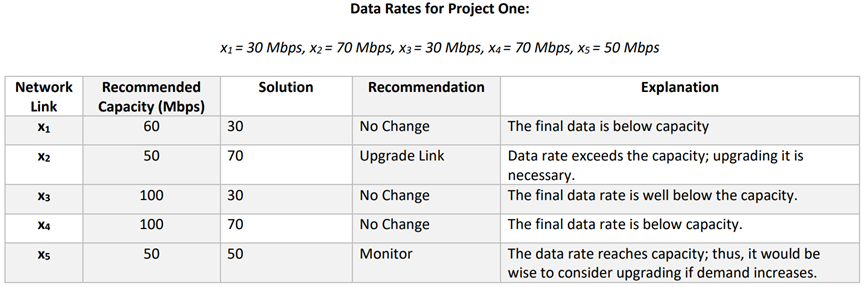

# <span style="color:rgb(213,80,0)"> **Project One:** ***<samp>Data Flow Modeling Using Matrix Theory</samp>***</span>

# <samp>Applied Linear Algebra</samp>  |   *Student Name:* *<samp>Ryan Hatch</samp>* *|  Date:* *<samp>10/4/24</samp>*
```python
%<><><><><><><><><><><><><><><><><><><><><><><><><><><><><><><><><><><><><><>
```

# <span style="color:rgb(213,80,0)">**Problem 1**</span>

#  **Develop a system of linear equations for the network** by writing an equation for each router <samp>(A, B, C, D, and E)</samp>. 
# Make sure to write your final answer as <samp>A</samp>**<samp>x</samp>**<samp>=</samp>**<samp>b</samp>** where <samp>A</samp> is the <samp>5x5</samp> coefficient matrix, **<samp>x</samp>** is the <samp>5x1</samp> vector of unknowns, and **<samp>b</samp>** is a <samp>5x1</samp> vector of constants.
## Solution \- Define the data rates between routers:

<samp>x1: From Router A to Router B</samp>


<samp>x2: From Router A to Router E</samp>


<samp>x3: From Router B to Receiver</samp>


<samp>x4: From Router E to Router D</samp>


<samp>x5: From Router C to Router D</samp>


**The system of equations based on inputs and outputs for each router is:**


1. <samp>Router A: x1 + x2 = 100</samp>


2. <samp>Router B: x1 = x3</samp>


3. <samp>Router C: x5 = 50</samp>


4. <samp>Router D: x4 + x5 = 120</samp>


5. <samp>Router E: x2 = x4</samp>


**Defining the matrix A, vector x, and vector b:**


<samp>A = [1  1  0  0  0;    -1  0  1  0  0;     0  0  0  0  1;     0  0  0  1  1;     0 -1  0  1  0];</samp>


<samp>x = ['x1'; 'x2'; 'x3'; 'x4'; 'x5'];</samp>


<samp>b = [100; 0; 50; 120; 0];</samp>


**Code to display the matrix and constant vector:**

```python
% Defining the coefficient matrix A and vector b for the system Ax = b
A = [1  1  0  0  0;  % Equation for Router A: x1 + x2 = 100
    -1  0  1  0  0;  % Equation for Router B: x1 = x3
     0  0  0  0  1;  % Equation for Router C: x5 = 50
     0  0  0  1  1;  % Equation for Router D: x4 + x5 = 120
     0 -1  0  1  0]; % Equation for Router E: x2 = x4

b = [100;  % Input to Router A
      0;   % Output from Router B to Receiver
      50;  % Input to Router C
      120; % Output from Router D to Receiver
      0];  % Output from Router E to Router D

% Display the coefficient matrix and constant vector
disp('Coefficient matrix A:');
```

```matlabTextOutput
Coefficient matrix A:
```

```python
disp(A);
```

```matlabTextOutput
     1     1     0     0     0
    -1     0     1     0     0
     0     0     0     0     1
     0     0     0     1     1
     0    -1     0     1     0
```

```python
disp('Constant vector b:');
```

```matlabTextOutput
Constant vector b:
```

```python
disp(b);
```

```matlabTextOutput
   100
     0
    50
   120
     0
```

```python
%<><><><><><><><><><><><><><><><><><><><><><><><><><><><><><><><><><><><><><>
```

# <span style="color:rgb(213,80,0)">**Problem 2**</span>

Use MATLAB to construct the augmented matrix \[A **b**\] and then perform row reduction using the rref() function. Write out your **reduced matrix and identify the free and basic variables of the system**.

## Solution:
```python
% Define the coefficient matrix A
A = [1,  1,  0,  0,  0;
    -1,  0,  1,  0,  0;
     0,  0,  0,  0,  1;
     0,  0,  0,  1,  1;
     0, -1,  0,  1,  0];

% Define the constants vector b
b = [100; 0; 50; 120; 0];

% Construct the augmented matrix [A | b]
AugmentedMatrix = [A b];

% Perform row reduction using rref()
ReducedMatrix = rref(AugmentedMatrix);

% Display the reduced matrix
disp('Reduced Augmented Matrix:');
```

```matlabTextOutput
Reduced Augmented Matrix:
```

```python
disp(ReducedMatrix);
```

```matlabTextOutput
     1     0     0     0     0    30
     0     1     0     0     0    70
     0     0     1     0     0    30
     0     0     0     1     0    70
     0     0     0     0     1    50
```

**Reduced Augmented Matrix:**


1 0 0 0 0 30


0 1 0 0 0 70


0 0 1 0 0 30


0 0 0 1 0 70


0 0 0 0 1 50


 **Identification of Variables:** *All variables x1, x2, x3, x4, x5 are basic variables.* 


There are also no free variables and the system has a unique solution.

```python
%<><><><><><><><><><><><><><><><><><><><><><><><><><><><><><><><><><><><><><>
```

# <span style="color:rgb(213,80,0)">**Problem 3**</span>

Use MATLAB to **compute the LU decomposition of A**, i.e., find A = LU. For this decomposition, find the transformed set of equations L**y** = **b**, where **y** = U**x**. Solve the system of equations L**y** = **b** for the unknown vector **y**.

## Solution:
```python
% Perform LU decomposition
[L, U] = lu(A);

% Display L and U matrices
disp('L matrix:');
```

```matlabTextOutput
L matrix:
```

```python
disp(L);
```

```matlabTextOutput
     1     0     0     0     0
    -1     1     0     0     0
     0     0     0     0     1
     0     0     0     1     0
     0    -1     1     0     0
```

```python
disp('U matrix:');
```

```matlabTextOutput
U matrix:
```

```python
disp(U);
```

```matlabTextOutput
     1     1     0     0     0
     0     1     1     0     0
     0     0     1     1     0
     0     0     0     1     1
     0     0     0     0     1
```

```python

% Solve L * y = b for y
y = L \ b;

% Display the vector y
disp('Solution vector y:');
```

```matlabTextOutput
Solution vector y:
```

```python
disp(y);
```

```matlabTextOutput
   100
   100
   100
   120
    50
```

The *<samp>lu()</samp>* function solves for the <samp>LU</samp> decomposition of <samp>matrix A.</samp>


**L** is a lower triangular matrix, and **U** is an upper triangular matrix.


I solved **<samp>Ly = b</samp>** using forward substitution.

```python
%<><><><><><><><><><><><><><><><><><><><><><><><><><><><><><><><><><><><><><>
```

# <span style="color:rgb(213,80,0)">**Problem 4**</span>

 **Compute the inverse** of U using the inv() function using MATLAB.

## Solution:
```python
% Compute the inverse of U
U_inv = inv(U);

% Display the inverse of U
disp('Inverse of U:');
```

```matlabTextOutput
Inverse of U:
```

```python
disp(U_inv);
```

```matlabTextOutput
     1    -1     1    -1     1
     0     1    -1     1    -1
     0     0     1    -1     1
     0     0     0     1    -1
     0     0     0     0     1
```

The <samp>inv()</samp> function computes the inverse of a matrix.


Finding out the solution to **<samp>U^-1</samp>** helped me to find **<samp>x</samp>** again in the future.

```python
%<><><><><><><><><><><><><><><><><><><><><><><><><><><><><><><><><><><><><><>
```

# <span style="color:rgb(213,80,0)">**Problem 5**</span>

 **Compute the solution to the original system of equations** by transforming  **y** into **x**, i.e., compute **x** = inv(U)**y**.

## Solution:
```python
% Compute the solution vector x
x = U_inv * y;

% Display the solution vector x
disp('Solution vector x:');
```

```matlabTextOutput
Solution vector x:
```

```python
disp(x);
```

```matlabTextOutput
    30
    70
    30
    70
    50
```

Multiplying **<samp>U^-1</samp>** and <samp>y</samp> gave me the solution **<samp>x</samp>**.


This technically solves the original system **<samp>Ax = b</samp>**.

```python
%<><><><><><><><><><><><><><><><><><><><><><><><><><><><><><><><><><><><><><>
```

# <span style="color:rgb(213,80,0)">**Problem 6**</span>

 **Check answer for** $x_1$ **using Cramer’s Rule.** Use MATLAB to compute the required determinants using the det() function. 

## Solution:
```python
% Compute the determinant of A
detA = det(A);

% Replace the first column of A with b to form A1
A1 = A;
A1(:,1) = b;

% Compute the determinant of A1
detA1 = det(A1);

% Compute x1 using Cramer's Rule
x1 = detA1 / detA;

% Display the computed x1
disp('x1 computed using Cramer''s Rule:');
```

```matlabTextOutput
x1 computed using Cramer's Rule:
```

```python
disp(x1);
```

```matlabTextOutput
   30.0000
```

**Cramer's Rule:**  <samp>xi = det(Ai) / det(A) -</samp>  where <samp>Ai</samp> is <samp>A</samp> with its <samp>i-th</samp> column replaced by <samp>b.</samp>


I solved <samp>det(A)</samp> and <samp>det(A1)</samp> in order to find <samp>x1.</samp>

```python
%<><><><><><><><><><><><><><><><><><><><><><><><><><><><><><><><><><><><><><>
```

# <span style="color:rgb(213,80,0)">**Problem 7**</span>

### Solution for the system of equations in the third column so it can be easily compared to the maximum capacity in the second column. 
### In the fourth column of the table, provide recommendations for how the network should be modified based on your network throughput analysis findings. The modification options can be <samp>No Change</samp>, <samp>Remove Link</samp>, or <samp>Upgrade Link.</samp> In the final column, explain how you arrived at your recommendation.
## Solution:




*By modeling the network as a system of linear equations and then applying matrix techniques to solve them, I was able to find out what the data rates for each link in the network are. Using the tools from MATLAB I was able to perform tasks like row reduction, LU decomposition, and I also applied Cramer's Rule to verify the solutions. In the final result, I then gave recommendations that were based on the data rates to make sure that the network operates at the most optimal rate without over working or exceeding any link capacities.*

```python
%<><><><><><><><><><><><><><><><><><><><><><><><><><><><><><><><><><><><><><>
```
"# Applied-Linear-Algebra" 
